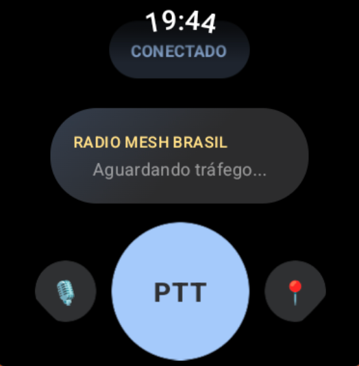

# Meshtastic Wear OS Client

<p align="center">
  
</p>

An offline-first, walkie-talkie-style communication client for Wear OS smartwatches that operates entirely without internet connectivity by interfacing with the Meshtastic LoRa mesh network.

---

## Architecture Overview

The application is built using modern Android development practices, emphasizing a clean separation of concerns and round-optimized user interface elements:

- **UI Layer (Jetpack Compose for Wear OS):** Optimized for round screens (e.g., Samsung Galaxy Watch) to avoid edge text clipping. It features a Double Scroll mechanism allowing simultaneous vertical navigation of the main screen and independent scrolling of message history.
- **ViewModel (PttViewModel):** Manages local state, connection statuses, audio recording triggers, and message persistence. Following the Single Responsibility Principle, message formatting and GPS packet parsing are encapsulated in the ViewModel using structured `UiMessage` models.
- **Model Layer:** Handles background speech operations:
  - **Speech-to-Text (STT):** Local, offline transcription by interfacing with the open-source **Sayboard** keyboard via native `SpeechRecognizer` API.
  - **Text-to-Speech (TTS):** Automatic, smart read-aloud of received text messages (skipping geographic coordinates).
  - **MiniProto:** Encapsulates the binary encoding/decoding of Meshtastic packets (positions, telemetry/battery, and text messages) over standard 4-byte TCP socket framing (`0x94 0xC3 [Length] [Payload]`).

---

## Prerequisites

To run and test the application, ensure your environment meets the following requirements:

- **Operating System:** macOS (recommended) or Linux.
- **Java Development Kit (JDK):** Java 17.
- **Android SDK:** Installed with Android SDK Command-line Tools and platform tools (`adb`, `emulator`).
- **Python:** Python 3.10+ (for running the simulator `mesh_mock`).
- **Wear OS Emulator:** An Android Virtual Device (AVD) running Wear OS 3 or 4 (API 30+).

---

## Building the Project

Compile the debug APK using the Gradle Wrapper from the `wear/` directory:

```bash
cd wear/
./gradlew assembleDebug
```

The compiled APK will be located at:
`wear/wear/build/outputs/apk/debug/wear-debug.apk`

---

## Running the Simulator (Mesh Mock)

The `mesh_mock` is a lightweight Python simulator that acts as a local LoRa radio node and handles packet broadcast between connected watches.

1. Navigate to the simulator folder:
   ```bash
   cd mesh_mock/
   ```
2. Create and activate a Python virtual environment:
   ```bash
   python3 -m venv .venv
   source .venv/bin/activate
   ```
3. Install dependencies:
   ```bash
   pip install -r requirements.txt
   ```
4. Start the mock server on port 4403:
   ```bash
   python mock_server.py --no-ble --port 4403
   ```

---

## Launching Two Emulators (P2P Chat Demo)

To simulate a real point-to-point walkie-talkie conversation between two smartwatches on the mock network:

1. Ensure a Wear OS emulator (AVD) is installed.
2. Run the automation script:
   ```bash
   ./scripts/launch_two_emulators.sh            # Portuguese-Brazil (default)
   ./scripts/launch_two_emulators.sh --locale en # English (US)
   ```
This script will:
- Clean up previous emulator/simulator processes.
- Start the `mesh_mock` server.
- Spin up two independent instances of the same Wear OS AVD (using `-read-only` and `-port` flags).
- Wait for both devices to boot completely.
- Build and install the Meshtastic Wear app and the **Sayboard** keyboard on both emulators.
- Launch the main screen on both devices.

---

## Running BDD Tests (Cucumber / Espresso)

The integration tests validate the complete end-to-end communication flow (UI interaction, network packet exchange, and TTS playback) using Cucumber:

### Running on a Running Emulator
To execute BDD tests on an already running and connected Wear OS emulator, use:
```bash
cd wear/
./gradlew clean installDebug connectedDebugAndroidTest
```

### Headless Automation Run
To automatically spin up an emulator, start the mock server, run the test suite, capture screenshots, and clean up everything:
```bash
./scripts/run_integration_tests.sh
```

---

## SOLID & Clean Code Compliance

This project adheres to strict clean architecture principles:
- **Single Responsibility Principle (SRP):** UI layout is completely separated from networking and parsing logic. `PttScreen` handles view rendering only, while `PttViewModel` controls state and coordinates parsing.
- **Dependency Inversion Principle (DIP):** The ViewModel operates on the `MeshConnection` and `TtsManager` interfaces, allowing clean dependency injection of standard production implementations (`TcpMeshClient`, `NativeTtsManager`) or mock replacements during BDD runs.
- **Internationalization (i18n):** All user-facing strings are migrated to Android resource dictionaries, providing seamless default English and localized Portuguese-Brazil support.

---

## 🛠️ TODO & Roadmap

For a detailed list of pending tasks, field test plans, and upcoming features, see [TODO.md](TODO.md):

- [ ] **Real Hardware Integration & Field Tests:** Connect and validate Bluetooth LE/TCP communication with physical Meshtastic radio nodes (Heltec V3, LilyGO T-Beam, RAK Wireless).
- [ ] **Native Portuguese Offline STT Model:** Bundle `vosk-model-small-pt-0.3` into the Sayboard APK for 100% offline Portuguese voice transcription.
- [ ] **Channel Management & AES-256 Encryption:** Channel switching interface and PSK key management.
- [ ] **Wear OS Ambient Mode & Battery Optimization:** Always-on Display support for extended battery life during active PTT sessions.

---

## Credits & Acknowledgements

Special thanks to the open-source projects that make offline communication and speech recognition possible:

- **[Sayboard](https://github.com/elishaazaria/sayboard):** An exceptional open-source offline Wear OS keyboard and speech recognition service created by **Elisha Azaria**. Sayboard embeds the Vosk speech recognition engine, enabling 100% offline speech-to-text functionality directly on smartwatches without internet connectivity.
- **[Meshtastic](https://meshtastic.org/):** An open-source, off-grid, decentralized mesh communication system designed to operate on low-power LoRa radios.
- **[Vosk Speech Recognition](https://alphacephei.com/vosk/):** An offline speech recognition toolkit providing acoustic speech models for mobile and embedded devices.

---

## License

This project is licensed under the [MIT License](LICENSE).

