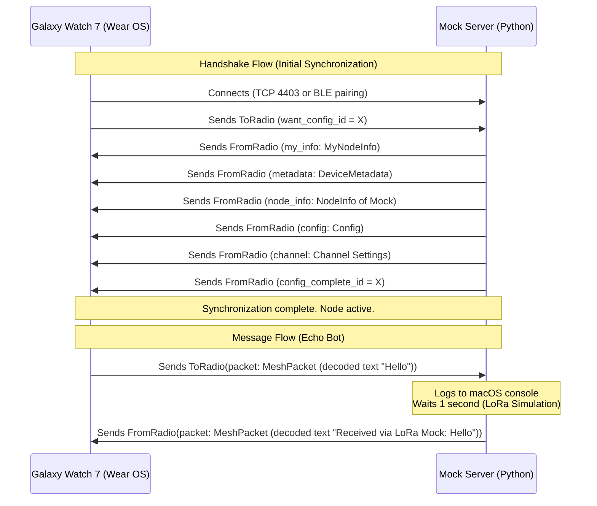

# Technical Specification - Meshtastic Mock Server

This document details the architectural, protocol, Protocol Buffers (Protobuf) structure, and modeling aspects of the `mock_server.py` script.

---

## 1. General Solution Architecture

The simulator is structured as a concurrent Python application that manages network connections in parallel. It exposes two main entry points:
1. **TCP Server (Port 4403):** Manages raw stream/socket-based connections with Meshtastic's custom framing control.
2. **BLE GATT Server (Optional):** Simulates the physical behavior of a radio advertising the Meshtastic GATT service using the `bless` library and interacts through reads/writes and notifications.

All logical communication is based on **Meshtastic Protobuf** messages (`ToRadio` and `FromRadio`).

### Sequence Diagram (Connection and Transmission)



---

## 2. Protocol Details

### 2.1 Framing in TCP/Stream
Since TCP is continuous stream-oriented, Meshtastic inserts a **4-byte** header in front of each sent/received protobuf message:

| Byte | Value | Description |
| :--- | :--- | :--- |
| **0** | `0x94` | Magic synchronization byte 1 (`START1`) |
| **1** | `0xC3` | Magic synchronization byte 2 (`START2`) |
| **2-3** | `uint16` | Length of the subsequent Protobuf payload (in Big-Endian format) |

When the simulator sends a packet to the watch, it must do:
```python
import struct
payload_bytes = from_radio.SerializeToString()
header = struct.pack(">BBH", 0x94, 0xC3, len(payload_bytes))
socket.sendall(header + payload_bytes)
```

And to receive, it must read the 4-byte header, extract the size, and read exactly that number of bytes before passing it to the protobuf decoder.

---

## 2.2 Bluetooth Low Energy (BLE) GATT
When the watch connects via BLE, it does not use the 4-byte framing header. It interacts directly with GATT characteristics using BLE's natural message boundaries.

* **Main Service UUID:** `6ba1b218-15a8-461f-9fa8-5dcae273eafd` (or `6ba1b080-b420-4be9-ae09-a94a325c3726` for mock compatibility).
* **GATT Characteristics:**

| Char Name | UUID | Properties | Description |
| :--- | :--- | :--- | :--- |
| **`TORADIO`** | `f75c76d2-129e-4dad-a1dd-7866124401e7` | `WRITE` | The client writes serialized `ToRadio` messages directly to this characteristic. |
| **`FROMRADIO`** | `2c55e69e-4993-11ed-b878-0242ac120002` | `READ` | The client reads serialized `FromRadio` messages from this characteristic. |
| **`FROMNUM`** | `ed9da18c-a800-4f66-a670-aa7547e34453` | `NOTIFY` | Sends a notification containing a 4-byte counter (little-endian) to indicate new packets are in the `FROMRADIO` buffer. |

#### BLE Transmission Flow:
1. When there is a new `FromRadio` packet to be sent to the watch, the simulator inserts the packet into an output queue (buffer) and increments a local counter.
2. The simulator updates the `FROMNUM` characteristic value with the counter converted to a 4-byte Little-Endian `uint32` and triggers a BLE notification.
3. The watch receives the notification, knows that data is available, and reads from the `FROMRADIO` characteristic.
4. When reading `FROMRADIO`, the simulator returns the packet from the output queue. The watch continues reading `FROMRADIO` until it receives an empty message (0 bytes).

---

## 3. Class and Function Structure

The `mock_server.py` script uses asynchronous programming (`asyncio`) to efficiently manage TCP connections and, at the same time, execute the BLE server loop if available.

### Software Components:

* **`MeshtasticMock` (Main Class):**
  - Maintains the simulated node state (node ID, reboot count, channel and region configurations).
  - Maintains message queues for sending to connected clients.
  - Implements the creation of handshake protobuf packets (`build_handshake_packets`).

* **`handle_tcp_client(reader, writer)` (Async Function):**
  - Handles the lifecycle of a client connected via TCP.
  - Reads and deframes received data (resolving the `0x94 0xC3` header).
  - Passes the `ToRadio` message to the event router.
  - Executes a background task that takes packets from the output queue and sends them formatted with the 4-byte header to the watch.

* **`ble_write_callback(characteristic, value)` (BLE Server Method):**
  - Callback triggered by the `bless` library when Wear OS writes to the `TORADIO` characteristic.
  - Processes the `ToRadio` message directly.

* **`build_echo_response(original_packet)` (Function):**
  - Analyzes a text packet (`MeshPacket`).
  - Waits 1 second.
  - Builds and inserts the encapsulated echo bot response into the transmission queue containing the prefix `"Received via LoRa Mock: "`.
