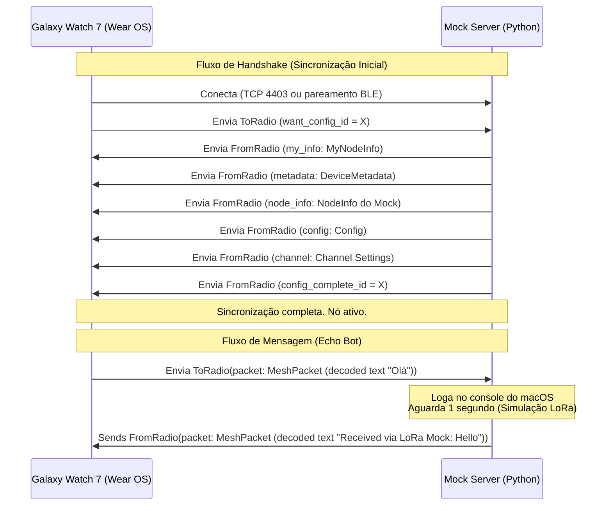

# Especificação Técnica - Mock Server Meshtastic

Este documento detalha os aspectos de arquitetura, protocolo, estruturas do Protocol Buffers (Protobuf) e a modelagem do script `mock_server.py`.

---

## 1. Arquitetura Geral da Solução

O simulador é estruturado como uma aplicação Python concorrente que gerencia conexões de rede em paralelo. Ela expõe dois pontos de entrada principais:
1. **Servidor TCP (Porta 4403):** Gerencia conexões baseadas em streams raw/socket com controle de enquadramento (framing) personalizado do Meshtastic.
2. **Servidor BLE GATT (Opcional):** Simula o comportamento físico de um rádio que anuncia o serviço GATT do Meshtastic utilizando a biblioteca `bless` e interage por meio de leituras/escritas e notificações.

Toda a comunicação lógica baseia-se em mensagens do **Protobuf do Meshtastic** (`ToRadio` e `FromRadio`).

### Diagrama de Sequência (Conexão e Transmissão)



---

## 2. Detalhamento do Protocolo

### 2.1 Enquadramento (Framing) no TCP/Stream
Como o TCP é orientado a fluxo contínuo de bytes, o Meshtastic insere um cabeçalho de **4 bytes** na frente de cada mensagem protobuf enviada/recebida:

| Byte | Valor | Descrição |
| :--- | :--- | :--- |
| **0** | `0x94` | Byte mágico de sincronização 1 (`START1`) |
| **1** | `0xC3` | Byte mágico de sincronização 2 (`START2`) |
| **2-3** | `uint16` | Comprimento do payload Protobuf subsequente (em formato Big-Endian) |

Quando o simulador envia um pacote para o relógio, ele deve fazer:
```python
import struct
payload_bytes = from_radio.SerializeToString()
header = struct.pack(">BBH", 0x94, 0xC3, len(payload_bytes))
socket.sendall(header + payload_bytes)
```

E para receber, deve ler o cabeçalho de 4 bytes, extrair o tamanho e ler exatamente esse número de bytes antes de passar para o decodificador protobuf.

---

## 2.2 Bluetooth Low Energy (BLE) GATT
Quando o relógio conecta via BLE, ele não usa o cabeçalho de enquadramento de 4 bytes. Ele interage diretamente com as características GATT usando os limites naturais de mensagens do BLE.

* **UUID do Serviço Principal:** `6ba1b218-15a8-461f-9fa8-5dcae273eafd` (ou `6ba1b080-b420-4be9-ae09-a94a325c3726` para compatibilidade mock).
* **Características GATT:**

| Nome da Caract. | UUID | Propriedades | Descrição |
| :--- | :--- | :--- | :--- |
| **`TORADIO`** | `f75c76d2-129e-4dad-a1dd-7866124401e7` | `WRITE` | O cliente escreve mensagens `ToRadio` serializadas diretamente nesta característica. |
| **`FROMRADIO`** | `2c55e69e-4993-11ed-b878-0242ac120002` | `READ` | O cliente lê mensagens `FromRadio` serializadas nesta característica. |
| **`FROMNUM`** | `ed9da18c-a800-4f66-a670-aa7547e34453` | `NOTIFY` | Envia uma notificação contendo um contador de 4 bytes (little-endian) para indicar que há novos pacotes no buffer `FROMRADIO`. |

#### Fluxo de Transmissão via BLE:
1. Quando há um novo pacote `FromRadio` a ser enviado para o relógio, o simulador insere o pacote em uma fila de saída (buffer) e incrementa um contador local.
2. O simulador atualiza o valor da característica `FROMNUM` com o valor do contador convertido em um `uint32` Little-Endian de 4 bytes e dispara uma notificação BLE.
3. O relógio recebe a notificação, sabe que há dados disponíveis e realiza uma leitura na característica `FROMRADIO`.
4. Ao ler `FROMRADIO`, o simulador retorna o pacote da fila de saída. O relógio continua lendo `FROMRADIO` até receber uma mensagem vazia (0 bytes).

---

## 3. Estrutura de Classes e Funções

O script `mock_server.py` utiliza programação assíncrona (`asyncio`) para gerenciar as conexões TCP de forma eficiente e, ao mesmo tempo, executar o loop do servidor BLE se ele estiver disponível.

### Componentes de Software:

* **`MeshtasticMock` (Classe Principal):**
  - Mantém o estado do nó simulado (ID do nó, contagem de reboot, configurações de canais e regiões).
  - Mantém as filas de mensagens para envio aos clientes conectados.
  - Implementa a criação dos pacotes protobuf de handshake (`build_handshake_packets`).

* **`handle_tcp_client(reader, writer)` (Função Assíncrona):**
  - Trata o ciclo de vida de um cliente conectado via TCP.
  - Lê e desenquadra dados recebidos (resolvendo o cabeçalho `0x94 0xC3`).
  - Passa a mensagem `ToRadio` para o roteador de eventos.
  - Executa uma task em background que retira pacotes da fila de saída de mensagens e os envia formatados com o cabeçalho de 4 bytes para o relógio.

* **`ble_write_callback(characteristic, value)` (Método do Servidor BLE):**
  - Callback acionado pela biblioteca `bless` quando o Wear OS escreve na característica `TORADIO`.
  - Processa a mensagem `ToRadio` diretamente.

* **`build_echo_response(original_packet)` (Função):**
  - Analisa um pacote de texto (`MeshPacket`).
  - Aguarda 1 segundo.
  - Constrói e insere na fila de transmissão a resposta encapsulada do bot de eco contendo o prefixo `"Received via LoRa Mock: "`.
